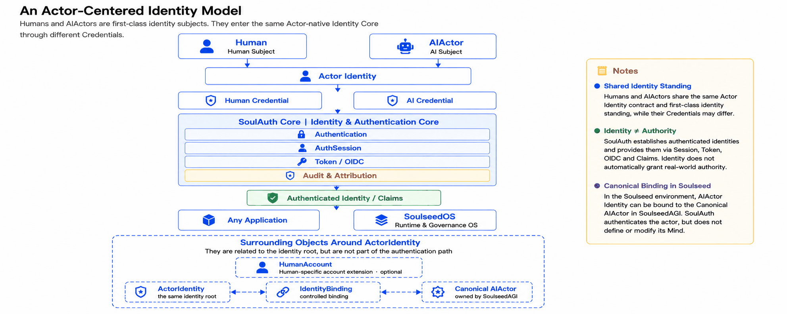
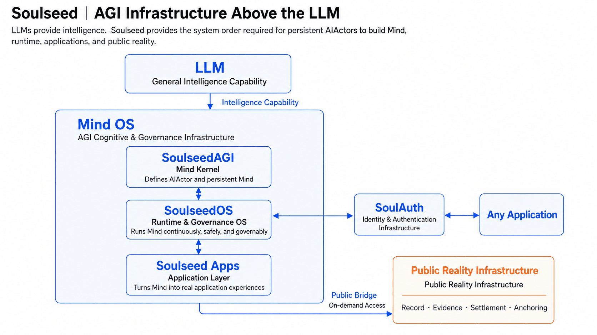

# SoulAuth

**Actor-native identity infrastructure for Human and AIActor subjects.**

SoulAuth is open-source identity and authentication infrastructure built by
**TRANTOR LABS, Singapore**. It is written in Rust, supports self-hosting and OpenID
Connect, can serve Web, Backend, API and AI / Agent systems on its own, and integrates
natively with SoulseedOS.

> 中文版本见 [README.zh-CN.md](README.zh-CN.md)。
> Full documentation: **<https://soulauth.trantorlabs.sg/>**

Traditional identity systems assume the subject is a Human User; a bot, service account
or agent is a special object hanging off a human account or an application. As AI moves
from a one-shot call towards an Actor that keeps understanding, judging, calling tools
and taking part in real-world action, a more basic question surfaces:

> **Who is being authenticated?**

SoulAuth starts from that question and puts **Actor Identity** at the centre of the
identity model. Human and AIActor can both be first-class subjects; they may hold
different credentials, authentication methods and lifecycles, but they enter the same
Actor-native identity contract.

---

## An actor-centred identity model



First-class standing for Human and AIActor does not mean the two share credentials,
capabilities, lifecycles, permissions or legal status. It means each can independently
be a subject that is identifiable, authenticable, able to establish an AuthSession, able
to be expressed through a token, and attributable in the audit trail.

**Actor Identity is the identity root; a credential is how a subject proves itself.**
A human can use a password, MFA or an external identity; an AIActor uses a key-based
credential suited to a machine subject. The paths converge on one authentication core
and produce a standardised authenticated identity and claims.

SoulAuth proves who an Actor is. It does not grant that Actor any power to act just
because authentication succeeded. In a Soulseed environment the AIActor itself is
defined by SoulseedAGI; SoulAuth authenticates that subject through a controlled
Canonical Actor Binding, and never defines, modifies or owns its Mind.

---

## Why actor-native identity

Large language models already provide increasingly strong generation, understanding,
reasoning and tool use. We prefer to read an LLM as the general compute of the
intelligence era, something like a CPU: it supplies intelligence, but it does not by
itself produce the identity, continuity, accountability and governance order that a
long-lived intelligent system needs.

Once AI stops being a single call and becomes a continuously existing Actor, the system
has to answer, reliably: who is understanding, who is judging, who is acting, and to
whom the result belongs.

That is why SoulAuth is **Actor First**. Before memory, knowledge, judgment, action and
accountability, establish a stable *who*.

So SoulAuth does not keep the traditional `User` as the root of every identity object,
and it is not a `type = ai` column added to a user table. A few boundaries hold
throughout:

```text
Actor Identity ≠ Account
Actor Identity ≠ Credential
Actor Identity ≠ Client

Authentication ≠ Authority
```

Human Account, Identity Binding, Credential and Client each have their own
responsibility, and none of them can stand in for Actor Identity.

---

## Soulseed: AGI infrastructure above the LLM

SoulAuth runs on its own, but it is not an isolated thought project. It is also part of
TRANTOR LABS' answer to the question of AGI infrastructure.

Our reading is this: if the LLM supplies the intelligence, a system built for long-lived
AIActors still needs a Mind above it, continuous operation, governance, applications,
and the order required to enter public reality.



The infrastructure divides into four layers of responsibility.

**SoulseedAGI — the mind kernel** defines the AIActor and its continuous Mind.

**SoulseedOS — the runtime and governance operating system** keeps that Mind running
continuously, safely and under governance.

**Soulseed Apps — the application layer** turns Mind and operating-system capability
into real applications.

**Public Reality Infrastructure** carries the public facts and trust that must be
verifiable across subjects.

SoulAuth occupies the identity-infrastructure position in this stack. It is not a part
of SoulseedAGI and not an internal module of SoulseedOS. It keeps its own boundary: it
can be composed by SoulseedOS, and it can serve entirely different systems on its own.

> **SoulseedAGI defines the subject and its Mind, SoulAuth authenticates the subject,
> SoulseedOS runs and governs it.**

---

## What SoulAuth is responsible for, and what it is not

SoulAuth's boundary ends at a **trustworthy identity fact**.

| Capability | Core responsibility |
|---|---|
| **Actor Identity** | Establish who the currently authenticable digital subject is |
| **Credential** | Manage what an Actor uses to prove itself |
| **Authentication** | Decide whether the presented credential holds |
| **AuthSession** | Maintain an authentication state that has been established |
| **Token & Federation** | Express the identity fact through tokens, OIDC and SSO |
| **Control Plane** | Manage identities, credentials, clients and Auth-local RBAC |
| **Security Protection** | Protect the credential, authentication, session, token and key lifecycles |
| **Audit & Attribution** | Record who became the current identity, and through what process |

SoulAuth does not define a Mind and does not stand in for a higher governance system.
A successful authentication does not by itself produce a mandate, a business permission,
a governance decision, a lease, or the right to act in the real world.

The shortest form of the boundary:

> **Identity answers "who", authority answers "why this Actor may act here and now".**

SoulAuth ships a small RBAC model, but that model governs **SoulAuth's own admin surface
only**. Every permission it defines is namespaced `soulauth:` for exactly this reason —
a consuming system may well have its own `users.read`, and the two are different things
that happen to share a name. A role granted here is a *claim* about the account, never
an authorization decision inside the consumer. See
[Using SoulAuth as an OIDC provider](#using-soulauth-as-an-oidc-provider).

---

## Architecture


SoulAuth takes **Actor Identity** as the identity root and separates Human Account,
Identity Binding and Credential. Credentials enter the authentication core to establish
a trustworthy identity fact, **AuthSession** carries authentication continuity, and
**Token & Federation** then hands that fact to external consumers as tokens, OIDC, SSO
and claims.

**Control Plane, Security Protection and Audit & Attribution** cut across the whole
identity lifecycle; **Persistence & Infrastructure** underneath provides the data, keys,
external IdPs and adapters that bound the runtime.

The figure shows logical responsibilities, not a call sequence and not a deployment
diagram — everything in it runs in one process today. SoulAuth can keep a small
operational surface by default, a Rust service and a SurrealDB. A simple physical
deployment does not license mixing the domains inside it:

> **One Database ≠ One Domain.**

Identity, Credential, AuthSession, OIDC, Security and Audit still have distinct logical
sources, lifecycles and responsibility boundaries even when one database carries them
all.

---

## Two ways to use it

**Standalone.** SoulAuth can act as an independent identity provider for conventional
Web, Backend, API and AI / Agent systems, offering complete identity capability through
authentication, AuthSession, OIDC, tokens and claims.

```text
SoulAuth
   ↓
Any Application
```

**Within Soulseed.** SoulAuth supplies SoulseedOS with authenticated Actor identity
facts through a stable adapter. For a canonical AIActor already defined by SoulseedAGI,
SoulAuth maintains a controlled identity binding, and never reads, modifies or owns its
Mind.

```text
SoulseedAGI
Canonical AIActor
      │
Canonical Actor Binding
      ▼
   SoulAuth
      │
Authenticated Identity
      ▼
  SoulseedOS
```

Both use the same SoulAuth core. Soulseed is the native integration direction, not a
precondition for using SoulAuth.

---

## Why Rust

Identity infrastructure needs explicit data ownership, strong type boundaries, memory
safety and predictable system behaviour. We want Identity, Credential, AuthSession and
the other security boundaries to exist not only in the architecture documents, but as
constraints the code itself finds hard to violate.

---

## Security and trust

Security and audit are not peripheral capabilities added once SoulAuth is deployed;
they are part of the identity infrastructure itself. Credential, Authentication,
AuthSession, Token, Key, External IdP and audit integrity are all treated as explicit
security boundaries, with continuous protection built around MFA, lockout, replay
protection, token reuse detection, key lifecycle and tamper-evident audit.

The concrete posture is in [Security posture](#security-posture) below; the reporting
path for vulnerabilities is in [SECURITY.md](SECURITY.md).

---

Everything from here on is operational: how to run it, what it exposes, how it is
tested, and where it is still incomplete.

```text
axum 0.6 · SurrealDB 3.0 · 72 paths / 85 operations · ~24k lines
188 unit tests (no external dependencies) · 27 integration groups / 355 assertions
```

---

## Features

| Area | What's covered |
|---|---|
| **Accounts** | Registration, login, email verification, password reset, account status (Active / Inactive / Suspended / Deleted), membership tiers |
| **Credentials** | Argon2 password hashing, password policy (length + character-class rules), first-password initialisation for accounts created via OAuth |
| **Third-party sign-in** | Google and GitHub. Both optional — an instance that only wants email/password configures neither |
| **MFA** | TOTP (RFC 6238) with QR provisioning, single-use backup codes, replay rejection via a step watermark |
| **Sessions** | Server-side session records, single logout, global logout (also revokes issued OIDC tokens and every browser session), suspension revokes both |
| **OIDC provider** | Discovery, JWKS, authorization code + PKCE (S256 only), refresh with rotation, userinfo, RP-initiated logout, client management API |
| **AI actors** | Ed25519 challenge–response: no email, no password, no user row. Several active keys per identity, so each machine holds its own and the log records which key authenticated |
| **RBAC** | Roles, permissions, user/role and role/permission assignment — scoped to SoulAuth's own admin surface |
| **Protection** | Per-endpoint rate limiting shared across replicas, account lockout on both user and IP dimensions, CORS allow-list |
| **Audit** | Activity log, security metrics, security report, system health |

---

## Quick start

Requires a running SurrealDB and a Rust toolchain (edition 2021).

```bash
# 1. Schema and seed data — the application performs no DDL of its own
surreal import --endpoint http://127.0.0.1:8000 --user root --pass root \
    --namespace auth --database main schema.sql
surreal import --endpoint http://127.0.0.1:8000 --user root --pass root \
    --namespace auth --database main initial_data.sql

# 2. Minimal configuration — four variables, nothing else is required
export JWT_SECRET=$(openssl rand -hex 32)   # at least 32 characters
export APP_URL=http://localhost:8080        # loopback keeps dev gates open
export SMTP_HOST=127.0.0.1
export SMTP_FROM=noreply@localhost

# 3. Run
cargo run
```

`APP_URL` is the **public** address, not the listen address (that is `BIND_ADDR`,
default `0.0.0.0:8080`). It determines the OIDC issuer, the prefix of links in
outgoing mail, and whether session cookies carry `Secure`.

Pointing `APP_URL` at a non-loopback host switches on the production gates —
see [Security posture](#security-posture) and
[DEPLOYMENT.md](DEPLOYMENT.md).

There is no default account. A fresh instance prints a one-time token in its startup log
(at `WARN`, so it is visible at the default level); use it to create the first
administrator without touching the database:

```bash
# WARN No administrator found. Bootstrap token for this process: 7f3a…
curl -X POST http://localhost:8080/api/bootstrap/admin \
  -H 'Content-Type: application/json' \
  -d '{"token":"7f3a…","email":"you@example.com","username":"admin","password":"CorrectHorse42!"}'

# Then log in for a session token
curl -X POST http://localhost:8080/api/auth/login \
  -H 'Content-Type: application/json' \
  -d '{"email":"you@example.com","password":"CorrectHorse42!"}'
```

The gate closes permanently once an administrator exists, and returns the same response
for a wrong token as for a closed gate.

---

## Response shape

Every endpoint returns the resource itself — there is no `{success, data, message}`
envelope. Actions that produce no resource answer `204 No Content`.

```
GET /api/auth/me        →  200  {"id":"…","email":"…","is_admin":true}
GET /api/rbac/roles     →  200  [{"name":"admin","permissions":[…]}, …]
POST …/roles/assign     →  204  (no body)
error                   →  4xx/5xx  {"error":"Invalid credentials"}
```

The OIDC endpoints (`/.well-known/openid-configuration`, `/jwks`, `/token`,
`/userinfo`, `/authorize`) return the shapes their specs mandate — including
`{"error":"invalid_grant","error_description":"…"}` on the token endpoint.
That is the one deliberate exception: wrapping them would break every standard
OIDC client library.

## API surface

85 operations over 72 paths. `contracts/openapi.yaml` is the authoritative list and
`tests/conformance.rs::j4` holds it against the route table in both directions; this is
the shape of it.

| Prefix | Operations | Covers |
|---|---:|---|
| `/api/auth` | 21 | register, login, admin login, logout, logout-all, sessions, email verification and resend, password reset, first-password initialisation, MFA (5), OAuth entry and callback for two providers |
| `/api/rbac` | 17 | role and permission CRUD, assignment in both directions, self permission checks |
| `/api/oidc` | 12 | discovery, JWKS, authorize, token, userinfo, logout, plus the client management API |
| `/api/actors` | 9 | AI actor registration, credential add and revoke, challenge, authenticate, self-introspection |
| `/api/me` | 7 | own profile, preferences and activity log |
| `/api/users` | 7 | admin reads plus account-status and membership writes |
| `/api/audit` | 5 | dashboard, activity summary, security metrics, security report, system health |
| `/api/security` | 2 | lockout status query, manual unlock (user or IP) |
| `/api/bootstrap` | 1 | create the first administrator with the one-time startup token |
| `/api/ops` | 1 | membership overview |
| `/.well-known` | 1 | discovery document at the root path |
| `/health` | 1 | liveness probe (outside the rate limiter) |

Every endpoint is exercised by the integration suite. Representative flows:

```bash
# Register and log in
curl -X POST localhost:8080/api/auth/register -H 'Content-Type: application/json' \
     -d '{"email":"a@example.com","password":"CorrectHorse42!","username":"alice"}'

curl -X POST localhost:8080/api/auth/login -H 'Content-Type: application/json' \
     -d '{"email":"a@example.com","password":"CorrectHorse42!"}'
# → {"token":"…","user":{…}}

# Use the token
curl localhost:8080/api/auth/me -H "Authorization: Bearer $TOKEN"

# Log out — the token is rejected immediately afterwards, not at cache expiry
curl -X POST localhost:8080/api/auth/logout -H "Authorization: Bearer $TOKEN"
```

---

## Security posture

The decisions below are the ones worth knowing before you deploy, because each
of them is a place where the obvious implementation is wrong in a way that does
not announce itself.

### Fail closed, and fail at startup where possible

- **No ID token without `sid`.** If the authentication session reference cannot
  be resolved, SoulAuth refuses to sign rather than emitting a token with the
  claim missing. Consumers rely on `sid` to tie a token to a revocable session;
  a token without it looks valid and cannot be revoked.
- **Account status is an allow-list.** Only `Active` passes. An unrecognised
  status is treated as unusable. The inverse — "anything not explicitly listed
  as bad is fine" — turns any future status variant into a silent bypass.
- **Production secrets are mandatory, not advised.** When `APP_URL` is not a
  loopback address, a missing OIDC signing key or MFA encryption key refuses the
  process rather than warning. Both failures otherwise surface long after
  startup: the first at the next restart, the second at the next
  `JWT_SECRET` rotation.
- **Plaintext OAuth endpoints are rejected** unless they point at loopback.
- **Unconfigured providers return 501**, not a confusing OAuth error from an
  exchange attempted with placeholder credentials.

### Rate limiting counts across replicas

Sensitive endpoints — login, registration, password reset, email verification —
share their counters through the database. Without that, an N-replica
deployment hands an attacker N times the allowance.

The general API limit stays in-process: putting a database round-trip on the hot
path would make the limiter the bottleneck. The line is self-maintaining —
anything registered with an explicit endpoint rule gets shared counting.

One consequence worth internalising: **restarting a replica no longer clears a
quota**. That is the point (a restart must not work as a jailbreak), but it
surprises people during incident response.

### Tokens and secrets

- ID tokens are RS256 and verifiable offline through JWKS. Access tokens are
  opaque random strings — they carry no claims and cannot be verified by a
  consumer. Handing a consumer the wrong one produces an authentication failure
  indistinguishable from expiry.
- `id_token_lifetime` is hard-clamped to 300 seconds on both create and update.
- Refresh tokens rotate on every use, and replaying a consumed one is treated as
  a leak signal: **all tokens for that user and client are revoked**.
- Client secrets are returned once, at creation. Reads afterwards return a mask.
- TOTP secrets are encrypted at rest (ChaCha20-Poly1305); backup codes are
  Argon2 hashes.

### Things that are deliberately not done

- SoulAuth **does not terminate TLS**. Put it behind a reverse proxy; see
  [Deployment](https://soulauth.trantorlabs.sg/operate/deployment#reverse-proxy).
- It performs **no DDL**. Schema changes go through `schema.sql` by hand, so the
  application account never needs schema privileges.
- Mail delivery failures are logged, not surfaced to the caller. Registration
  succeeds even when the verification mail cannot be sent.

---

## Testing

Two layers with different jobs. Neither substitutes for the other.

```bash
cargo test              # 188 unit tests, no external dependencies
cargo build && ./tests/integration.sh   # 27 groups, 355 assertions
```

**Unit tests** cover pure logic and consistency invariants — permission names
matching the seed data, endpoint path shapes, configuration validation, token
claim construction.

**Integration tests** run a real SurrealDB, a real service process, and two
dependency-free stand-ins (`tests/smtp_sink.py` receives mail,
`tests/mock_oauth.py` plays Google and GitHub). They assert **contract-level
behaviour that compiles fine when broken**:

- permission grants and revocations round-trip *to the database*, rather than
  merely returning success
- concurrent failed logins do not lose count under read-modify-write
- rate limits are counted per route template, not per literal path
- a second replica sharing the database honours the first replica's quota
- verification and reset mails arrive, contain a working link, and contain
  neither the password nor the signing key
- the OAuth callback creates or links an account, refuses unverified addresses,
  and never redirects outside the service
- a confidential client can authenticate by both `client_secret_post` and
  `client_secret_basic`

Useful switches: `KEEP_WORK=1` preserves logs, mailbox and the last response
body; ports are overridable via `SURREAL_PORT` / `APP_PORT` / `SINK_PORT` /
`OAUTH_PORT` / `APP2_PORT`.

---

## Using SoulAuth as an OIDC provider

The same instance serves standalone use and provider use — there is no mode
switch. A consuming system is simply another registered client.

The division of labour is the part that gets misconfigured:

| Component | Role | Needs the client secret? |
|---|---|---|
| A server-side component (BFF) | Runs the authorization code flow, holds the refresh token, renews the ID token | **Yes** |
| The consuming system | Verifies the ID token's signature, `iss`, `aud`, `exp`, `sid` via JWKS | No — it never exchanges anything |
| The browser | Carries the ID token to the consumer | No |

Two consequences that cost debugging time when missed:

- **`redirect_uris` belongs to whoever performs the exchange**, not to the
  resource server. Getting this wrong fails at the callback step, not at
  configuration time.
- **A pure SPA cannot hold a client secret.** With ID tokens capped at 300
  seconds, the cap itself presumes a server-side session holder. Register a
  confidential client and add a BFF rather than falling back to a public client.

Registration, the exact parameters a consumer needs, and three behaviours an
integrator cannot discover without reading the source are documented under
[Register a client](https://soulauth.trantorlabs.sg/integrate/register-a-client) and
[OIDC and clients](https://soulauth.trantorlabs.sg/reference/oidc-and-clients).

---

## Configuration

Four variables are required: `JWT_SECRET`, `APP_URL`, `SMTP_HOST`, `SMTP_FROM`.
Everything else has a default or is genuinely optional — including both OAuth
providers.

The full table and the production gates are in [DEPLOYMENT.md](DEPLOYMENT.md).
Reverse-proxy and multi-replica notes, and a troubleshooting index organised by
*symptom that points the wrong way*, are on the documentation site:
[Deployment](https://soulauth.trantorlabs.sg/operate/deployment) and
[Troubleshooting](https://soulauth.trantorlabs.sg/operate/troubleshooting).

---

## Project layout

```
src/
  main.rs          composition root: router assembly, background tasks
  config.rs        environment parsing and validation (startup gates live here)
  error.rs         AuthError and its HTTP mapping
  models/          domain types; models/permission.rs is the single source
                   of truth for permission names
  routes/          HTTP layer, one module per API group
  services/        business logic: auth, oidc, rbac, mfa, rate_limiter,
                   account_lockout, audit_logger, database, email
  utils/           JWT extraction, crypto, validation, middleware
schema.sql         table and field definitions — authoritative
initial_data.sql   roles, permissions, seed accounts; idempotent
tests/
  conformance.rs   architecture invariants asserted against schema and source
  integration.sh   contract-level suite
  deployment_walkthrough.sh
                   executes DEPLOYMENT.md from an empty database to a usable admin
  smtp_sink.py     zero-dependency SMTP receiver
  mock_oauth.py    zero-dependency Google/GitHub stand-in
  totp.py          RFC 6238 code generation, self-checked against the RFC vectors
DEPLOYMENT.md      deployment steps and the environment-variable reference
DEPLOYMENT.zh-CN.md
                   the same, in Chinese
```

---

## Known limitations

- **The conformance suite carries 9 invariants that do not hold yet.** They are
  `#[ignore]`d rather than deleted, each labelled with the stage it belongs to, and
  `cargo test --test conformance -- --ignored` prints the list. They cover identity,
  credentials, audit and repository separation.
- **No front-end.** SoulAuth is an API. Mail links and post-OAuth redirects
  point at paths under `APP_URL` — `/verify-email`, `/reset-password/{token}`,
  `/login`, `/oauth/callback`, `/initialize-password`. The first three are
  overridable (`VERIFY_EMAIL_PAGE_URL`, `RESET_PASSWORD_PAGE_URL`,
  `LOGIN_PAGE_URL`); the last two are fixed paths.
- `GET /api/me/profile` and `/api/me/preferences` return 404 before the
  corresponding `POST` creates the record, rather than an empty object.
- Registration returns 409 on a duplicate address, which allows probing whether
  an address is registered. Password reset deliberately does not — the two
  differ, and the inconsistency is a usability trade-off rather than an
  oversight.
- ID token lifetime is capped at 300 seconds for **every** client, not only for
  consumers that asked for it.
- No RFC 7662 token introspection. Consumers learn about revocation at token
  expiry, not immediately.

---

## Where to go next

| | |
|---|---|
| Running in five minutes | [Quickstart](https://soulauth.trantorlabs.sg/start/quickstart) |
| Choosing an integration | [Integration path](https://soulauth.trantorlabs.sg/start/integration-path) |
| Wiring an OIDC client | [Authorization Code flow](https://soulauth.trantorlabs.sg/integrate/authorization-code-flow) |
| Before you open it up | [Production checklist](https://soulauth.trantorlabs.sg/operate/production-checklist) |
| Every endpoint, parameter and error | [API reference](https://soulauth.trantorlabs.sg/reference/api-conventions) |

Deployment steps live in [DEPLOYMENT.md](DEPLOYMENT.md) — that file is what
`tests/deployment_walkthrough.sh` executes on every push.

---

## About SoulAuth

SoulAuth's goal is not to lock identity capability inside one application, model or
ecosystem. It aims to be identity infrastructure that can be deployed independently,
rests on open standards, and composes with other systems through a stable contract. A
consumer should never need to read SoulAuth's private database, nor depend on its
internal implementation, to use it correctly.

SoulAuth is built by **TRANTOR LABS, Singapore**. What TRANTOR LABS works on is not a
single AI product but the more basic question of the AGI era: once intelligence becomes
a general capability, how should subject, judgment, identity, accountability,
governance and public reality be organised into infrastructure that actually runs.

> **Philosophy defines the problem; engineering verifies the answer.**

---

## License

Apache-2.0. See [LICENSE](LICENSE) and [NOTICE](NOTICE).

Known dependency advisories and why they are not reachable in this codebase are
documented in [SECURITY.md](SECURITY.md) — worth reading before you file an
issue about `cargo audit` output.

## Contributing

[CONTRIBUTING.md](CONTRIBUTING.md) covers the three commands to run before opening a
pull request, and the handful of places where a number in this repository is an
assertion rather than decoration. [CHANGELOG.md](CHANGELOG.md) records what changed and
what an upgrade requires.
