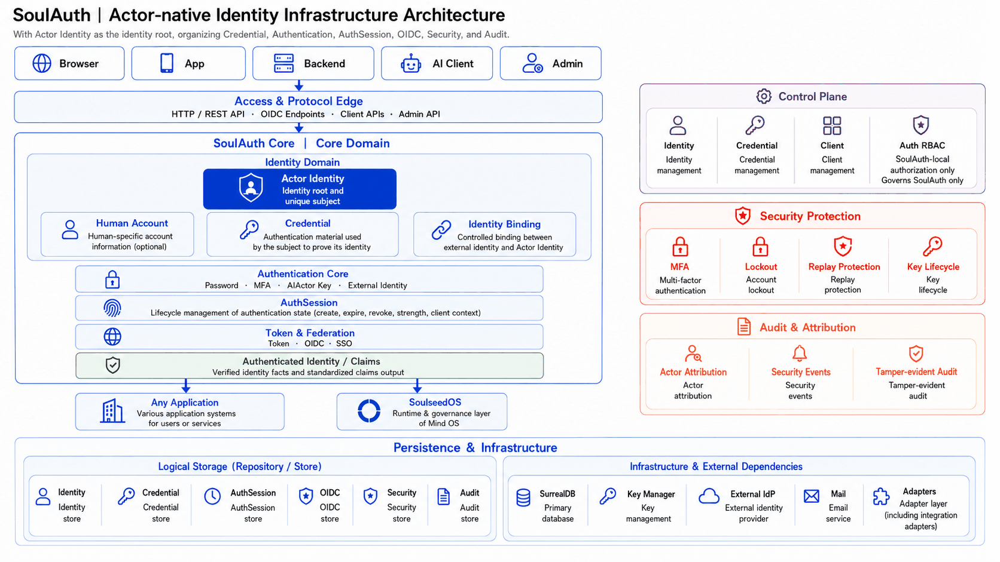

# SoulAuth

A self-hosted authentication service written in Rust that speaks standard OpenID
Connect, so a client library that already talks to Keycloak or Auth0 talks to it without
changes.

What it does differently: an AI actor gets an identity record and an Ed25519 key of its
own, rather than a `user` row with a made-up email address on it.

**Documentation: <https://soulauth.trantorlabs.sg/>** — integration guides, the full API reference rendered from
the machine-readable contract, and the operations pages.

> 中文版本见 [README.zh-CN.md](README.zh-CN.md)。

```
axum 0.6 · SurrealDB 3.0 · 71 paths / 84 operations · ~22k lines
188 unit tests (no external dependencies) · 27 integration groups / 355 assertions
```



Logical responsibilities, not a call sequence and not a deployment diagram —
everything shown runs in one process today.

---

## What it is, and what it deliberately is not

**It is** the answer to *who is this*: registration, login, email verification,
password reset, MFA, third-party sign-in, AI actor authentication, session lifecycle,
and an OIDC provider that other systems verify against.

**It is not** the answer to *what may they do* in your system. SoulAuth carries
a small RBAC model, but that model governs **SoulAuth's own admin surface only**.
Every permission it defines is namespaced `soulauth:` for exactly this reason —
a consuming system may well have its own `users.read`, and the two are different
things that happen to share a name.

The distinction matters at integration time: a role granted here is a *claim*
about the account, never an authorization decision inside the consumer. See
[Using SoulAuth as an OIDC provider](#using-soulauth-as-an-oidc-provider).

---

## Features

| Area | What's covered |
|---|---|
| **Accounts** | Registration, login, email verification, password reset, account status (Active / Inactive / Suspended / Deleted), membership tiers |
| **Credentials** | Argon2 password hashing, password policy (length + character-class rules), first-password initialisation for accounts created via OAuth |
| **Third-party sign-in** | Google and GitHub. Both optional — an instance that only wants email/password configures neither |
| **MFA** | TOTP (RFC 6238) with QR provisioning, single-use backup codes, replay rejection via a step watermark |
| **Sessions** | Server-side session records, single logout, global logout (also revokes issued OIDC tokens and every browser session), suspension revokes both |
| **OIDC provider** | Discovery, JWKS, authorization code + PKCE (S256 only), refresh with rotation, userinfo, RP-initiated logout, client management API |
| **AI actors** | Ed25519 challenge–response: no email, no password, no user row. Several active keys per identity, so each machine holds its own and the log records which key authenticated |
| **RBAC** | Roles, permissions, user/role and role/permission assignment — scoped to SoulAuth's own admin surface |
| **Protection** | Per-endpoint rate limiting shared across replicas, account lockout on both user and IP dimensions, CORS allow-list |
| **Audit** | Activity log, security metrics, security report, system health |

---

## Quick start

Requires a running SurrealDB and a Rust toolchain (edition 2021).

```bash
# 1. Schema and seed data — the application performs no DDL of its own
surreal import --endpoint http://127.0.0.1:8000 --user root --pass root \
    --namespace auth --database main schema.sql
surreal import --endpoint http://127.0.0.1:8000 --user root --pass root \
    --namespace auth --database main initial_data.sql

# 2. Minimal configuration — four variables, nothing else is required
export JWT_SECRET=$(openssl rand -hex 32)   # at least 32 characters
export APP_URL=http://localhost:8080        # loopback keeps dev gates open
export SMTP_HOST=127.0.0.1
export SMTP_FROM=noreply@localhost

# 3. Run
cargo run
```

`APP_URL` is the **public** address, not the listen address (that is `BIND_ADDR`,
default `0.0.0.0:8080`). It determines the OIDC issuer, the prefix of links in
outgoing mail, and whether session cookies carry `Secure`.

Pointing `APP_URL` at a non-loopback host switches on the production gates —
see [Security posture](#security-posture) and
[DEPLOYMENT.md](DEPLOYMENT.md).

There is no default account. A fresh instance prints a one-time token in its startup log
(at `WARN`, so it is visible at the default level); use it to create the first
administrator without touching the database:

```bash
# WARN No administrator found. Bootstrap token for this process: 7f3a…
curl -X POST http://localhost:8080/api/bootstrap/admin \
  -H 'Content-Type: application/json' \
  -d '{"token":"7f3a…","email":"you@example.com","username":"admin","password":"CorrectHorse42!"}'

# Then log in for a session token
curl -X POST http://localhost:8080/api/auth/login \
  -H 'Content-Type: application/json' \
  -d '{"email":"you@example.com","password":"CorrectHorse42!"}'
```

The gate closes permanently once an administrator exists, and returns the same response
for a wrong token as for a closed gate.

---

## Response shape

Every endpoint returns the resource itself — there is no `{success, data, message}`
envelope. Actions that produce no resource answer `204 No Content`.

```
GET /api/auth/me        →  200  {"id":"…","email":"…","is_admin":true}
GET /api/rbac/roles     →  200  [{"name":"admin","permissions":[…]}, …]
POST …/roles/assign     →  204  (no body)
error                   →  4xx/5xx  {"error":"Invalid credentials"}
```

The OIDC endpoints (`/.well-known/openid-configuration`, `/jwks`, `/token`,
`/userinfo`, `/authorize`) return the shapes their specs mandate — including
`{"error":"invalid_grant","error_description":"…"}` on the token endpoint.
That is the one deliberate exception: wrapping them would break every standard
OIDC client library.

## API surface

84 operations over 71 paths. `contracts/openapi.yaml` is the authoritative list and
`tests/conformance.rs::j4` holds it against the route table in both directions; this is
the shape of it.

| Prefix | Operations | Covers |
|---|---:|---|
| `/api/auth` | 21 | register, login, admin login, logout, logout-all, sessions, email verification and resend, password reset, first-password initialisation, MFA (5), OAuth entry and callback for two providers |
| `/api/rbac` | 17 | role and permission CRUD, assignment in both directions, self permission checks |
| `/api/oidc` | 12 | discovery, JWKS, authorize, token, userinfo, logout, plus the client management API |
| `/api/actors` | 9 | AI actor registration, credential add and revoke, challenge, authenticate, self-introspection |
| `/api/me` | 7 | own profile, preferences and activity log |
| `/api/users` | 7 | admin reads plus account-status and membership writes |
| `/api/audit` | 5 | dashboard, activity summary, security metrics, security report, system health |
| `/api/security` | 2 | lockout status query, manual unlock (user or IP) |
| `/api/bootstrap` | 1 | create the first administrator with the one-time startup token |
| `/api/ops` | 1 | membership overview |
| `/.well-known` | 1 | discovery document at the root path |
| `/health` | 1 | liveness probe (outside the rate limiter) |

Every endpoint is exercised by the integration suite. Representative flows:

```bash
# Register and log in
curl -X POST localhost:8080/api/auth/register -H 'Content-Type: application/json' \
     -d '{"email":"a@example.com","password":"CorrectHorse42!","username":"alice"}'

curl -X POST localhost:8080/api/auth/login -H 'Content-Type: application/json' \
     -d '{"email":"a@example.com","password":"CorrectHorse42!"}'
# → {"token":"…","user":{…}}

# Use the token
curl localhost:8080/api/auth/me -H "Authorization: Bearer $TOKEN"

# Log out — the token is rejected immediately afterwards, not at cache expiry
curl -X POST localhost:8080/api/auth/logout -H "Authorization: Bearer $TOKEN"
```

---

## Security posture

The decisions below are the ones worth knowing before you deploy, because each
of them is a place where the obvious implementation is wrong in a way that does
not announce itself.

### Fail closed, and fail at startup where possible

- **No ID token without `sid`.** If the authentication session reference cannot
  be resolved, SoulAuth refuses to sign rather than emitting a token with the
  claim missing. Consumers rely on `sid` to tie a token to a revocable session;
  a token without it looks valid and cannot be revoked.
- **Account status is an allow-list.** Only `Active` passes. An unrecognised
  status is treated as unusable. The inverse — "anything not explicitly listed
  as bad is fine" — turns any future status variant into a silent bypass.
- **Production secrets are mandatory, not advised.** When `APP_URL` is not a
  loopback address, a missing OIDC signing key or MFA encryption key refuses the
  process rather than warning. Both failures otherwise surface long after
  startup: the first at the next restart, the second at the next
  `JWT_SECRET` rotation.
- **Plaintext OAuth endpoints are rejected** unless they point at loopback.
- **Unconfigured providers return 501**, not a confusing OAuth error from an
  exchange attempted with placeholder credentials.

### Rate limiting counts across replicas

Sensitive endpoints — login, registration, password reset, email verification —
share their counters through the database. Without that, an N-replica
deployment hands an attacker N times the allowance.

The general API limit stays in-process: putting a database round-trip on the hot
path would make the limiter the bottleneck. The line is self-maintaining —
anything registered with an explicit endpoint rule gets shared counting.

One consequence worth internalising: **restarting a replica no longer clears a
quota**. That is the point (a restart must not work as a jailbreak), but it
surprises people during incident response.

### Tokens and secrets

- ID tokens are RS256 and verifiable offline through JWKS. Access tokens are
  opaque random strings — they carry no claims and cannot be verified by a
  consumer. Handing a consumer the wrong one produces an authentication failure
  indistinguishable from expiry.
- `id_token_lifetime` is hard-clamped to 300 seconds on both create and update.
- Refresh tokens rotate on every use, and replaying a consumed one is treated as
  a leak signal: **all tokens for that user and client are revoked**.
- Client secrets are returned once, at creation. Reads afterwards return a mask.
- TOTP secrets are encrypted at rest (ChaCha20-Poly1305); backup codes are
  Argon2 hashes.

### Things that are deliberately not done

- SoulAuth **does not terminate TLS**. Put it behind a reverse proxy; see
  [Deployment](https://soulauth.trantorlabs.sg/operate/deployment#reverse-proxy).
- It performs **no DDL**. Schema changes go through `schema.sql` by hand, so the
  application account never needs schema privileges.
- Mail delivery failures are logged, not surfaced to the caller. Registration
  succeeds even when the verification mail cannot be sent.

---

## Testing

Two layers with different jobs. Neither substitutes for the other.

```bash
cargo test              # 188 unit tests, no external dependencies
cargo build && ./tests/integration.sh   # 27 groups, 355 assertions
```

**Unit tests** cover pure logic and consistency invariants — permission names
matching the seed data, endpoint path shapes, configuration validation, token
claim construction.

**Integration tests** run a real SurrealDB, a real service process, and two
dependency-free stand-ins (`tests/smtp_sink.py` receives mail,
`tests/mock_oauth.py` plays Google and GitHub). They assert **contract-level
behaviour that compiles fine when broken**:

- permission grants and revocations round-trip *to the database*, rather than
  merely returning success
- concurrent failed logins do not lose count under read-modify-write
- rate limits are counted per route template, not per literal path
- a second replica sharing the database honours the first replica's quota
- verification and reset mails arrive, contain a working link, and contain
  neither the password nor the signing key
- the OAuth callback creates or links an account, refuses unverified addresses,
  and never redirects outside the service
- a confidential client can authenticate by both `client_secret_post` and
  `client_secret_basic`

Useful switches: `KEEP_WORK=1` preserves logs, mailbox and the last response
body; ports are overridable via `SURREAL_PORT` / `APP_PORT` / `SINK_PORT` /
`OAUTH_PORT` / `APP2_PORT`.

---

## Using SoulAuth as an OIDC provider

The same instance serves standalone use and provider use — there is no mode
switch. A consuming system is simply another registered client.

The division of labour is the part that gets misconfigured:

| Component | Role | Needs the client secret? |
|---|---|---|
| A server-side component (BFF) | Runs the authorization code flow, holds the refresh token, renews the ID token | **Yes** |
| The consuming system | Verifies the ID token's signature, `iss`, `aud`, `exp`, `sid` via JWKS | No — it never exchanges anything |
| The browser | Carries the ID token to the consumer | No |

Two consequences that cost debugging time when missed:

- **`redirect_uris` belongs to whoever performs the exchange**, not to the
  resource server. Getting this wrong fails at the callback step, not at
  configuration time.
- **A pure SPA cannot hold a client secret.** With ID tokens capped at 300
  seconds, the cap itself presumes a server-side session holder. Register a
  confidential client and add a BFF rather than falling back to a public client.

Registration, the exact parameters a consumer needs, and three behaviours an
integrator cannot discover without reading the source are documented under
[Register a client](https://soulauth.trantorlabs.sg/integrate/register-a-client) and
[OIDC and clients](https://soulauth.trantorlabs.sg/reference/oidc-and-clients).

---

## Configuration

Four variables are required: `JWT_SECRET`, `APP_URL`, `SMTP_HOST`, `SMTP_FROM`.
Everything else has a default or is genuinely optional — including both OAuth
providers.

The full table and the production gates are in [DEPLOYMENT.md](DEPLOYMENT.md).
Reverse-proxy and multi-replica notes, and a troubleshooting index organised by
*symptom that points the wrong way*, are on the documentation site:
[Deployment](https://soulauth.trantorlabs.sg/operate/deployment) and
[Troubleshooting](https://soulauth.trantorlabs.sg/operate/troubleshooting).

---

## Project layout

```
src/
  main.rs          composition root: router assembly, background tasks
  config.rs        environment parsing and validation (startup gates live here)
  error.rs         AuthError and its HTTP mapping
  models/          domain types; models/permission.rs is the single source
                   of truth for permission names
  routes/          HTTP layer, one module per API group
  services/        business logic: auth, oidc, rbac, mfa, rate_limiter,
                   account_lockout, audit_logger, database, email
  utils/           JWT extraction, crypto, validation, middleware
schema.sql         table and field definitions — authoritative
initial_data.sql   roles, permissions, seed accounts; idempotent
tests/
  conformance.rs   architecture invariants asserted against schema and source
  integration.sh   contract-level suite
  deployment_walkthrough.sh
                   executes DEPLOYMENT.md from an empty database to a usable admin
  smtp_sink.py     zero-dependency SMTP receiver
  mock_oauth.py    zero-dependency Google/GitHub stand-in
  totp.py          RFC 6238 code generation, self-checked against the RFC vectors
DEPLOYMENT.md      deployment steps and the environment-variable reference
DEPLOYMENT.zh-CN.md
                   the same, in Chinese
```

---

## Known limitations

- **The conformance suite carries 9 invariants that do not hold yet.** They are
  `#[ignore]`d rather than deleted, each labelled with the stage it belongs to, and
  `cargo test --test conformance -- --ignored` prints the list. They cover identity,
  credentials, audit and repository separation.
- **No front-end.** SoulAuth is an API. Mail links and post-OAuth redirects
  point at paths under `APP_URL` — `/verify-email`, `/reset-password/{token}`,
  `/login`, `/oauth/callback`, `/initialize-password`. The first three are
  overridable (`VERIFY_EMAIL_PAGE_URL`, `RESET_PASSWORD_PAGE_URL`,
  `LOGIN_PAGE_URL`); the last two are fixed paths.
- `GET /api/me/profile` and `/api/me/preferences` return 404 before the
  corresponding `POST` creates the record, rather than an empty object.
- Registration returns 409 on a duplicate address, which allows probing whether
  an address is registered. Password reset deliberately does not — the two
  differ, and the inconsistency is a usability trade-off rather than an
  oversight.
- ID token lifetime is capped at 300 seconds for **every** client, not only for
  consumers that asked for it.
- No RFC 7662 token introspection. Consumers learn about revocation at token
  expiry, not immediately.

---

## Where to go next

| | |
|---|---|
| Running in five minutes | [Quickstart](https://soulauth.trantorlabs.sg/start/quickstart) |
| Choosing an integration | [Integration path](https://soulauth.trantorlabs.sg/start/integration-path) |
| Wiring an OIDC client | [Authorization Code flow](https://soulauth.trantorlabs.sg/integrate/authorization-code-flow) |
| Before you open it up | [Production checklist](https://soulauth.trantorlabs.sg/operate/production-checklist) |
| Every endpoint, parameter and error | [API reference](https://soulauth.trantorlabs.sg/reference/api-conventions) |

Deployment steps live in [DEPLOYMENT.md](DEPLOYMENT.md) — that file is what
`tests/deployment_walkthrough.sh` executes on every push.

---

## License

Apache-2.0. See [LICENSE](LICENSE) and [NOTICE](NOTICE).

Known dependency advisories and why they are not reachable in this codebase are
documented in [SECURITY.md](SECURITY.md) — worth reading before you file an
issue about `cargo audit` output.

## Contributing

[CONTRIBUTING.md](CONTRIBUTING.md) covers the three commands to run before opening a
pull request, and the handful of places where a number in this repository is an
assertion rather than decoration. [CHANGELOG.md](CHANGELOG.md) records what changed and
what an upgrade requires.
