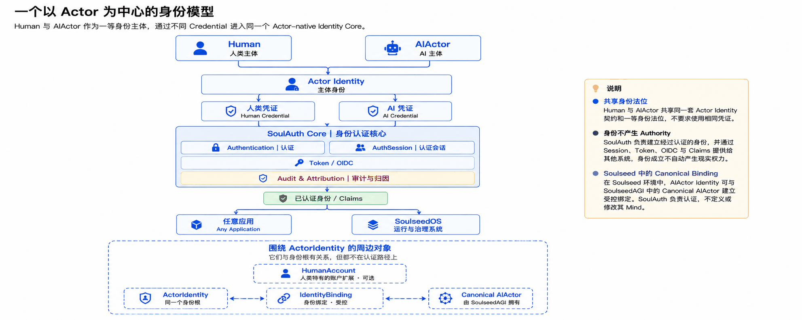
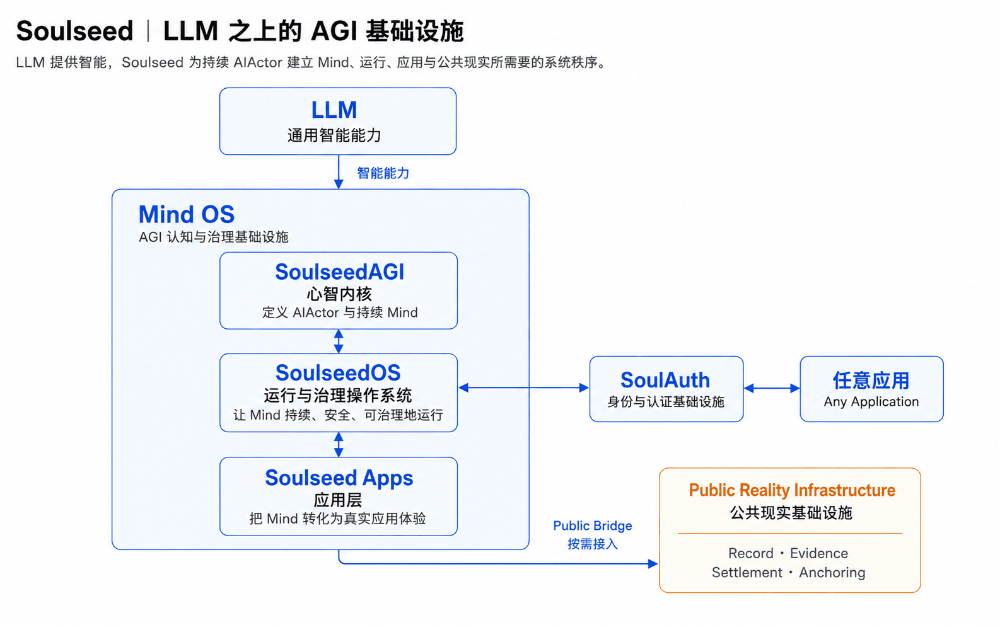
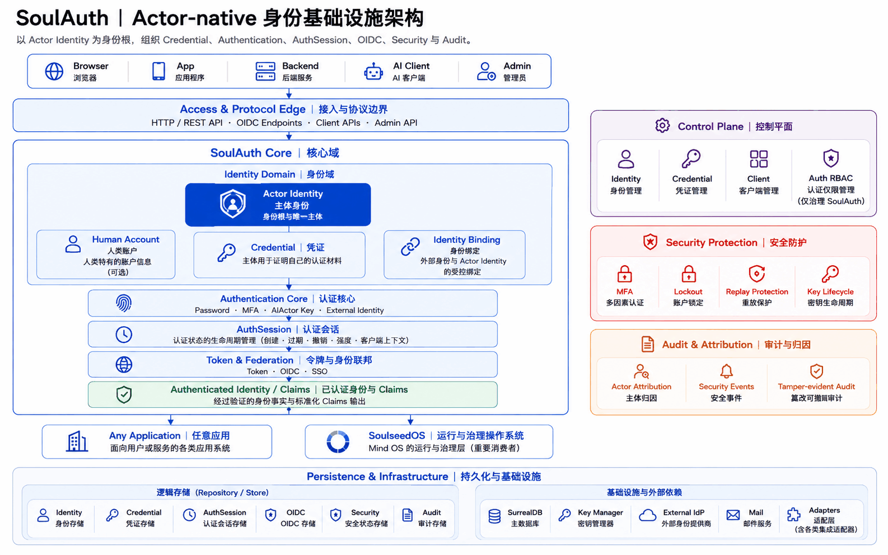

# SoulAuth

**面向 Human 与 AIActor 的 Actor-native 身份基础设施。**

SoulAuth 是由**新加坡 TRANTOR LABS** 构建的开源身份与认证基础设施。它使用 Rust
实现，支持自托管与 OpenID Connect，可独立服务 Web、Backend、API 与 AI / Agent
系统，也可以原生接入 SoulseedOS。

> English version: [README.md](README.md)（主版本）
> 完整文档：**<https://soulauth.trantorlabs.sg/>**

传统身份系统通常默认身份主体是 Human User，Bot、Service Account 或 Agent 只是附着在
人类账户或应用之下的特殊对象。随着 AI 从一次性调用逐渐走向能够持续理解、判断、调用
工具并参与现实行动的 Actor，一个更基础的问题开始出现：

> **谁正在被认证？**

SoulAuth 从这个问题出发，把 **Actor Identity** 放在身份模型的中心。Human 与 AIActor
都可以成为一等身份主体；它们可以拥有不同的 Credential、Authentication Method 与
Lifecycle，但进入同一套 Actor-native Identity Contract。

---

## 一个以 Actor 为中心的身份模型



Human 与 AIActor 的「一等身份法位」并不意味着二者拥有相同的 Credential、能力、
生命周期、权限或法律地位，而是意味着它们都可以独立成为可识别、可认证、可建立
AuthSession、可通过 Token 表达并可被 Audit 归因的身份主体。

**Actor Identity 是身份根，Credential 是证明主体的方式。** Human 可以使用 Password、
MFA 或外部身份，AIActor 可以使用适合机器主体的 Key-based Credential；不同认证路径
最终进入同一个 Authentication Core，并输出标准化的 Authenticated Identity / Claims。

SoulAuth 负责证明一个 Actor 是谁，但不会因为认证成功就自动赋予它行动权力。在
Soulseed 环境中，AIActor 的本体由 SoulseedAGI 定义，SoulAuth 通过受控的 Canonical
Actor Binding 对这个主体进行数字身份认证，而不定义、修改或拥有它的 Mind。

---

## 为什么是 Actor-native Identity

今天的大语言模型已经提供越来越强的生成、理解、推理和工具使用能力。我们更愿意把 LLM
理解为智能时代类似 CPU 的通用计算能力：它提供智能，却不会自动形成一个长期智能系统所
需要的身份、连续性、责任和治理秩序。

当 AI 从一次调用逐渐成为持续存在的 Actor，系统就必须能够稳定回答：是谁在理解，
是谁在判断，是谁在行动，结果最终归属于谁。

这也是 SoulAuth 采用 **Actor First** 的原因。在 Memory、Knowledge、Judgment、Action
与 Accountability 之前，首先建立稳定的「谁」。

SoulAuth 因而不把传统 `User` 继续当作所有身份对象的根，也不是简单给 User 表增加一个
`type = ai` 字段。几个基本边界长期成立：

```text
Actor Identity ≠ Account
Actor Identity ≠ Credential
Actor Identity ≠ Client

Authentication ≠ Authority
```

Human Account、Identity Binding、Credential 与 Client 都有自己的职责，但它们都不能
替代 Actor Identity。

---

## Soulseed：LLM 之上的 AGI 基础设施

SoulAuth 可以独立运行，但它不是一个孤立的思想项目。它也是新加坡 TRANTOR LABS 对 AGI
基础设施问题的一部分回答。

我们的基本判断是：如果 LLM 提供智能能力，那么真正面向长期 AIActor 的系统仍然需要在其
上建立 Mind、持续运行、治理、应用，以及进入公共现实所需要的系统秩序。



这套基础设施可以从四个责任层理解。

**SoulseedAGI｜心智内核**定义 AIActor 与持续 Mind。

**SoulseedOS｜运行与治理操作系统**让 Mind 持续、安全、可治理地运行。

**Soulseed Apps｜应用层**把 Mind 与操作系统能力转化为真实应用。

**Public Reality Infrastructure｜公共现实基础设施**承接跨主体可验证的公共事实与信任。

SoulAuth 位于这套体系的身份基础设施位置，但不是 SoulseedAGI 的组成部分，也不是
SoulseedOS 的内部模块。它保持独立边界，可以被 SoulseedOS 组合使用，也可以完全独立
服务其他系统。

> **SoulseedAGI 定义主体与 Mind，SoulAuth 认证主体，SoulseedOS 运行并治理主体。**

---

## SoulAuth 负责什么，也不负责什么

SoulAuth 的边界终止于**可信身份事实**。

| 能力 | 核心职责 |
|---|---|
| **Actor Identity** | 确定谁是当前可认证的数字主体 |
| **Credential** | 管理 Actor 用什么证明自己 |
| **Authentication** | 判断当前身份凭证是否成立 |
| **AuthSession** | 维持已经成立的认证状态 |
| **Token & Federation** | 通过 Token、OIDC 与 SSO 表达身份事实 |
| **Control Plane** | 管理 Identity、Credential、Client 与 Auth-local RBAC |
| **Security Protection** | 保护 Credential、Authentication、Session、Token 与 Key 生命周期 |
| **Audit & Attribution** | 记录谁通过什么过程成为当前身份 |

SoulAuth 不定义 Mind，也不替代更高层治理系统。Authentication 成功不会自动产生
Mandate、业务 Permission、Governance Decision、Lease 或现实执行权。

最简洁的边界是：

> **Identity 回答「是谁」，Authority 回答「为什么这个 Actor 此时此地有权行动」。**

SoulAuth 自带一个小的 RBAC 模型，但它只治理 **SoulAuth 自身的管理面**。它定义的每一条
权限都带 `soulauth:` 前缀正是为此 —— 接入方很可能也有自己的 `users.read`，两者只是
恰好同名的不同东西。在这里授出的角色是关于账户的一项*声明*，从来不是接入方内部的
授权判断。见[把 SoulAuth 当 OIDC Provider 用](#把-soulauth-当-oidc-provider-用)。

---

## SoulAuth 架构



SoulAuth 以 **Actor Identity** 为身份根，将 Human Account、Identity Binding 与
Credential 分离。Credential 进入 Authentication Core 建立可信身份事实，**AuthSession**
保持认证连续性，随后通过 **Token & Federation** 以 Token、OIDC、SSO 与 Claims 的形式
交给外部 Consumer。

**Control Plane、Security Protection 与 Audit & Attribution** 横向覆盖整个身份生命
周期；底层 **Persistence & Infrastructure** 则提供数据、Key、External IdP 与 Adapter
等运行边界。

图上是逻辑职责，不是调用时序，也不是部署图 —— 图中的一切今天都跑在同一个进程里。
SoulAuth 默认可以继续保持较小的运行面，例如 Rust Service 与 SurrealDB，但物理部署
简单并不意味着内部领域可以混写：

> **One Database ≠ One Domain.**

Identity、Credential、AuthSession、OIDC、Security 与 Audit 即使由同一数据库承载，
也仍然拥有不同的逻辑 Source、生命周期和责任边界。

---

## 两种使用方式

**Standalone。** SoulAuth 可以作为独立 Identity Provider 服务传统 Web、Backend、API
与 AI / Agent 系统，通过 Authentication、AuthSession、OIDC、Token 与 Claims 提供完整
身份能力。

```text
SoulAuth
   ↓
Any Application
```

**在 Soulseed 中。** SoulAuth 通过稳定 Adapter 向 SoulseedOS 提供经过认证的 Actor
身份事实。对于 SoulseedAGI 已经定义的 Canonical AIActor，SoulAuth 可以维护受控身份
绑定，但不会读取、修改或拥有其 Mind。

```text
SoulseedAGI
Canonical AIActor
      │
Canonical Actor Binding
      ▼
   SoulAuth
      │
Authenticated Identity
      ▼
  SoulseedOS
```

两种方式使用同一个 SoulAuth Core。Soulseed 是原生集成方向，但不是使用 SoulAuth 的
前提。

---

## 为什么使用 Rust

身份基础设施需要明确的数据所有权、强类型边界、内存安全和可预测的系统行为。我们希望
Identity、Credential、AuthSession 与其它安全边界不仅存在于架构文档中，也能够尽可能
成为代码本身不容易违反的约束。

---

## Security & Trust

Security 与 Audit 不是 SoulAuth 部署完成以后再增加的外围能力，而是身份基础设施本身的
一部分。Credential、Authentication、AuthSession、Token、Key、External IdP 与 Audit
Integrity 都被视为明确的安全边界，并围绕 MFA、Lockout、Replay Protection、Token Reuse
Detection、Key Lifecycle 与 Tamper-evident Audit 建立持续保护。

具体做法见下面的[生产姿态](#生产姿态)；安全问题的上报路径由
[SECURITY.md](SECURITY.md) 定义。

---

以下全部是操作性的内容：怎么跑起来、对外暴露什么、怎么测的，以及哪些地方还不完整。

```text
axum 0.6 · SurrealDB 3.0 · 72 条路径 / 85 个 operation · 约 2.4 万行
单元测试 188 项（零外部依赖）· 集成测试 27 组 355 项断言
```

---

## 功能

| 方面 | 覆盖内容 |
|---|---|
| **账号** | 注册、登录、邮箱验证、密码重置、账号状态（Active / Inactive / Suspended / Deleted）、会员等级 |
| **凭证** | Argon2 口令散列、口令策略（长度 + 字符类别）、为 OAuth 建号的无密码账号设置首个密码 |
| **第三方登录** | Google 与 GitHub，**两个都是可选的**——只用邮箱密码的部署一个都不必配 |
| **MFA** | TOTP（RFC 6238）含二维码下发、一次性备用码、基于时间窗水位线的重放拒绝 |
| **会话** | 服务端会话记录、单点登出、全端登出（同时吊销已签发的 OIDC 令牌与浏览器会话）、停用账号同样一并吊销 |
| **OIDC Provider** | 发现文档、JWKS、授权码 + PKCE（仅 S256）、带轮换的刷新、userinfo、RP 发起的登出、客户端管理接口 |
| **AI 主体** | Ed25519 挑战—应答：没有邮箱、没有口令、没有 user 行。一个身份可挂多把有效密钥，于是每台机器持有自己的一把，日志能记到是哪把钥匙认证的 |
| **RBAC** | 角色、权限、用户与角色、角色与权限的双向授予——范围限于 SoulAuth 自己的管理后台 |
| **防护** | 跨副本合账的分端点限流、账号与 IP 双维度锁定、CORS 白名单 |
| **审计** | 活动日志、安全指标、安全报告、系统健康 |

---

## 快速开始

需要一个跑着的 SurrealDB 和 Rust 工具链（edition 2021）。

```bash
# 1. 表结构与初始数据 —— 应用自身不执行任何 DDL
surreal import --endpoint http://127.0.0.1:8000 --user root --pass root \
    --namespace auth --database main schema.sql
surreal import --endpoint http://127.0.0.1:8000 --user root --pass root \
    --namespace auth --database main initial_data.sql

# 2. 最小配置 —— 只有四项是必填的
export JWT_SECRET=$(openssl rand -hex 32)   # 至少 32 字符
export APP_URL=http://localhost:8080        # 环回地址会让开发期闸门保持宽松
export SMTP_HOST=127.0.0.1
export SMTP_FROM=noreply@localhost

# 3. 运行
cargo run
```

`APP_URL` 是**对外地址**，不是监听地址（后者是 `BIND_ADDR`，默认
`0.0.0.0:8080`）。它决定三件事：OIDC 的 `issuer`、外发邮件里链接的前缀、
以及会话 cookie 是否带 `Secure`。

一旦把 `APP_URL` 指向非环回地址，生产闸门就会生效——见
[生产姿态](#生产姿态)与 [DEPLOYMENT.zh-CN.md](DEPLOYMENT.zh-CN.md)。

系统没有默认账号。新实例在启动日志里打一枚一次性令牌（`WARN` 级别，默认日志级别
下可见），用它建第一个管理员，全程不碰数据库：

```bash
# WARN No administrator found. Bootstrap token for this process: 7f3a…
curl -X POST http://localhost:8080/api/bootstrap/admin \
  -H 'Content-Type: application/json' \
  -d '{"token":"7f3a…","email":"you@example.com","username":"admin","password":"CorrectHorse42!"}'

# 再登录一次拿会话令牌
curl -X POST http://localhost:8080/api/auth/login \
  -H 'Content-Type: application/json' \
  -d '{"email":"you@example.com","password":"CorrectHorse42!"}'
```

系统里一旦存在管理员，这道门永久关闭，且对「令牌错」与「门已关」返回相同的响应。

---

## 响应形状

每个端点直接返回资源本身，**没有 `{success, data, message}` 信封**。
不产生资源的动作返回 `204 No Content`。

```
GET /api/auth/me        →  200  {"id":"…","email":"…","is_admin":true}
GET /api/rbac/roles     →  200  [{"name":"admin","permissions":[…]}, …]
POST …/roles/assign     →  204  （无响应体）
出错                     →  4xx/5xx  {"error":"Invalid credentials"}
```

OIDC 那几个端点（`/.well-known/openid-configuration`、`/jwks`、`/token`、
`/userinfo`、`/authorize`）返回各自规范规定的形状，包括令牌端点的
`{"error":"invalid_grant","error_description":"…"}`。这是唯一一处有意的例外：
给它们套外壳会让每一个标准 OIDC 客户端库解析失败。

## 接口面

72 条路径、85 个 operation。`contracts/openapi.yaml` 是权威清单，
`tests/conformance.rs::j4` 拿它与路由表双向对账；这里给的是它的形状。

| 前缀 | operation | 覆盖 |
|---|---:|---|
| `/api/auth` | 21 | 注册、登录、管理后台登录、登出、全端登出、会话列表、邮箱验证与重发、密码重置、首次设密、MFA（5 个）、两个 provider 的 OAuth 入口与回调 |
| `/api/rbac` | 17 | 角色与权限的增删查、双向授予、自身权限自查 |
| `/api/oidc` | 12 | 发现文档、JWKS、authorize、token、userinfo、logout，以及客户端管理 API |
| `/api/actors` | 9 | AI 主体注册、加密钥、吊销密钥、领挑战、认证、自省 |
| `/api/me` | 7 | 本人资料、偏好、活动日志 |
| `/api/users` | 7 | 管理员读取，以及账号状态与会员等级写入 |
| `/api/audit` | 5 | 看板、活动摘要、安全指标、安全报告、系统健康 |
| `/api/security` | 2 | 查询锁定状态、手工解锁（账号或 IP）|
| `/api/bootstrap` | 1 | 用启动时的一次性令牌建第一个管理员 |
| `/api/ops` | 1 | 会员总览 |
| `/.well-known` | 1 | 根路径上的发现文档 |
| `/health` | 1 | 存活探针（不受限流约束） |

每一个端点都被集成测试跑到。典型流程：

```bash
# 注册并登录
curl -X POST localhost:8080/api/auth/register -H 'Content-Type: application/json' \
     -d '{"email":"a@example.com","password":"CorrectHorse42!","username":"alice"}'

curl -X POST localhost:8080/api/auth/login -H 'Content-Type: application/json' \
     -d '{"email":"a@example.com","password":"CorrectHorse42!"}'
# → {"token":"…","user":{…}}

# 使用令牌
curl localhost:8080/api/auth/me -H "Authorization: Bearer $TOKEN"

# 登出 —— 之后原令牌立即失效，不是等缓存过期
curl -X POST localhost:8080/api/auth/logout -H "Authorization: Bearer $TOKEN"
```

---

## 生产姿态

下面这些是部署前值得知道的判断。它们的共同点是：**顺手的写法在这些地方恰好
是错的，而且错得不声不响。**

### 尽量 fail-closed，且尽量在启动时失败

- **取不到 `sid` 就拒签 ID Token。** 认证会话引用解析不出来时，宁可不签，
  也不签一张缺该 claim 的令牌。接入方靠 `sid` 把令牌挂到一个可吊销的会话上；
  缺了它的令牌看起来有效，却吊销不掉。
- **账号状态按白名单判定。** 只有 `Active` 放行，未知状态一律按不可用处理。
  反过来做——「没被显式列为坏的就算好的」——会让将来新增的任何状态变体
  变成一个不报错的放行漏洞。
- **生产密钥是必填而非建议。** `APP_URL` 非环回时，缺 OIDC 签名私钥或 MFA
  加密密钥会**拒绝启动**而不是打警告。这两项的后果都不在启动时显现：
  前者要等下次重启，后者要等下次轮换 `JWT_SECRET`。
- **明文 OAuth 端点只允许指向环回地址**，否则拒绝启动。
- **未配置的 provider 返回 501**，而不是拿占位凭证去换令牌、再吐一个看不懂的
  OAuth 错误。

### 限流跨副本合账

登录、注册、改密、邮箱验证这些敏感端点的计数经数据库共享。不这么做的话，
部署 N 个副本就等于把暴力破解的配额放大 N 倍。

一般 API 的限流仍在进程内：给热路径上每个请求都加一次数据库往返，等于把
限流器变成新的瓶颈。这条线是自我维护的——凡是配了显式端点规则的，
自动获得跨副本计数。

有一个后果值得记住：**重启副本不再清空配额**。这正是它该有的性质
（重启不能当解封手段），但故障处理时容易让人意外。

### 令牌与密钥

- ID Token 是 RS256，可通过 JWKS 离线验签；access token 是不透明随机串，
  不带任何 claim，接入方无法验证。**把后者当前者交给接入方，会得到一个与
  「令牌过期」无法区分的认证失败。**
- `id_token_lifetime` 在创建与更新时都被硬夹到 300 秒。
- 刷新令牌每次使用都轮换，重放已消费的令牌被视为泄露信号：
  **该用户在该客户端上的全部令牌一并吊销**。
- 客户端密钥只在创建时返回一次，之后读到的是掩码。
- TOTP 密钥加密落库（ChaCha20-Poly1305），备用码存 Argon2 散列。

### 刻意没做的事

- **不终结 TLS**。生产部署请放在反向代理之后，见文档站
  [部署](https://soulauth.trantorlabs.sg/zh/operate/deployment#反向代理配置)。
- **不执行任何 DDL**。表结构变更一律手工执行 `schema.sql`，
  这样应用账号永远不需要 schema 权限。
- **发信失败只记日志，不阻断请求**。SMTP 配错时注册照样成功，
  而验证信永远收不到——上线后请实际走一遍注册确认收得到信。

---

## 测试

两层，分工不同，谁也替代不了谁。

```bash
cargo test              # 单元测试 188 项，零外部依赖
cargo build && ./tests/integration.sh   # 27 组 355 项断言
```

**单元测试**管纯逻辑与一致性不变量：权限名与种子数据是否对得上、端点路径
形状、配置校验、令牌 claim 的构造。

**集成测试**起一个真的 SurrealDB、一个真的服务进程，外加两个零依赖的替身
（`tests/smtp_sink.py` 收信，`tests/mock_oauth.py` 扮演 Google 与 GitHub），
断言的是**坏掉了也照样编译通过**的那类契约行为：

- 授予与撤销权限要**落到库里**往返，而不是只看接口返回成功
- 并发失败登录不丢计数（读-改-写会丢）
- 限流按路由模板计数，而不是按字面路径
- 第二个共用数据库的副本，认第一个副本用掉的配额
- 验证信与重置信确实发出、链接可用，且正文里没有密码和签名密钥
- OAuth 回调能建号或关联既有账号、拒绝未验证邮箱、重定向不越出本服务
- 机密客户端用 `client_secret_post` 与 `client_secret_basic` 两种方式都能认证

实用开关：`KEEP_WORK=1` 保留日志、信箱与最后一次响应体；端口可用
`SURREAL_PORT` / `APP_PORT` / `SINK_PORT` / `OAUTH_PORT` / `APP2_PORT` 覆盖。

---

## 把 SoulAuth 当 OIDC Provider 用

同一个实例同时支撑独立使用与 Provider 使用，**没有模式开关**——接入方只是
又一个注册的客户端。

最容易配错的是分工：

| 组件 | 职责 | 需要 client secret 吗 |
|---|---|---|
| 服务端组件（BFF） | 走完授权码流程，持有 refresh token，负责续期 ID Token | **需要** |
| 接入方系统 | 用 JWKS 验 ID Token 的签名与 `iss` / `aud` / `exp` / `sid` | 不需要，它从不出站换令牌 |
| 浏览器 | 把 ID Token 带给接入方 | 不需要 |

两条踩中就要花冤枉时间的推论：

- **`redirect_uris` 属于执行授权码交换的那一方**，不是资源服务器。填错的
  表现是回调那一步失败，而不是配置阶段报错。
- **纯 SPA 无法安全持有 client secret**。ID Token 被夹在 300 秒，这个上限
  本身就假定了有一个服务端会话持有者。应当注册机密客户端并补一个 BFF，
  而不是退回 public 客户端了事。

注册命令、接入方需要的确切参数，以及**三条不读源码就不可能知道的行为**，
都写在文档站的[注册客户端](https://soulauth.trantorlabs.sg/zh/integrate/register-a-client)与
[OIDC 与客户端](https://soulauth.trantorlabs.sg/zh/reference/oidc-and-clients)。

---

## 配置

必填只有四项：`JWT_SECRET`、`APP_URL`、`SMTP_HOST`、`SMTP_FROM`。其余都有
默认值或确实可选——**包括两个 OAuth provider**。

完整清单与生产闸门在 [DEPLOYMENT.zh-CN.md](DEPLOYMENT.zh-CN.md)。反向代理与
多副本注意事项、以及一份按「症状指向错误方向」组织的故障排除索引，在文档站的
[部署](https://soulauth.trantorlabs.sg/zh/operate/deployment)与[故障排查](https://soulauth.trantorlabs.sg/zh/operate/troubleshooting)。

---

## 目录结构

```
src/
  main.rs          装配根：路由组装、后台任务
  config.rs        环境变量解析与校验（启动闸门在这里）
  error.rs         AuthError 及其 HTTP 映射
  models/          领域类型；models/permission.rs 是权限名的单一真相
  routes/          HTTP 层，一个 API 组一个模块
  services/        业务逻辑：auth、oidc、rbac、mfa、rate_limiter、
                   account_lockout、audit_logger、database、email
  utils/           JWT 提取、加解密、校验、中间件
schema.sql         表与字段定义 —— 权威来源
initial_data.sql   角色、权限、种子账号；幂等，可重复执行
tests/
  conformance.rs   对照 schema 与源码断言架构不变式
  integration.sh   契约级测试套件
  deployment_walkthrough.sh
                   把 DEPLOYMENT.md 从空库执行到一个可用的管理员
  smtp_sink.py     零依赖收信端
  mock_oauth.py    零依赖的 Google / GitHub 替身
  totp.py          RFC 6238 验证码生成，已用 RFC 标准向量自校
DEPLOYMENT.md      部署步骤与环境变量参考（英文，主版本）
DEPLOYMENT.zh-CN.md
                   同上，中文
```

---

## 已知限制

- **一致性测试里有 9 条不变式尚未成立。** 它们标了 `#[ignore]` 而不是删掉，
  每条都注明属于哪个 Stage，`cargo test --test conformance -- --ignored` 会列出全部。
  覆盖的是身份、凭证、审计与领域仓储隔离。
- **不含前端。** SoulAuth 是纯 API。邮件链接与 OAuth 后的重定向都指向
  `APP_URL` 下的路径——`/verify-email`、`/reset-password/{token}`、`/login`、
  `/oauth/callback`、`/initialize-password`。前三个可覆盖
  （`VERIFY_EMAIL_PAGE_URL`、`RESET_PASSWORD_PAGE_URL`、`LOGIN_PAGE_URL`），
  后两个是写死的路径。
- `GET /api/me/profile` 与 `/api/me/preferences` 在对应的 `POST` 建立记录之前
  返回 404，而不是空对象。
- 注册接口在邮箱重复时返回 409，可用于探测某个邮箱是否已注册；而密码重置
  刻意做了防枚举。两者口径不一致，是可用性取舍而非疏漏。
- ID Token 寿命对**所有**客户端一律夹到 300 秒，不只是对提出该要求的接入方。
- 没有 RFC 7662 令牌自省。接入方感知吊销要等到令牌自然过期。

---

## 接下来去哪

| | |
|---|---|
| 五分钟跑起来 | [快速上手](https://soulauth.trantorlabs.sg/zh/start/quickstart) |
| 决定怎么接入 | [接入路径](https://soulauth.trantorlabs.sg/zh/start/integration-path) |
| 接一个 OIDC 客户端 | [授权码流程](https://soulauth.trantorlabs.sg/zh/integrate/authorization-code-flow) |
| 开放访问之前 | [生产清单](https://soulauth.trantorlabs.sg/zh/operate/production-checklist) |
| 每个端点、参数与错误 | [API 参考](https://soulauth.trantorlabs.sg/zh/reference/api-conventions) |

部署步骤在 [DEPLOYMENT.zh-CN.md](DEPLOYMENT.zh-CN.md) —— 它和英文主版本
`DEPLOYMENT.md` 是同一份内容，后者正是
`tests/deployment_walkthrough.sh` 每次推送都要执行一遍的对象。

---

## 关于 SoulAuth

SoulAuth 的目标不是把身份能力锁在某个应用、模型或生态中，而是提供一个**可独立部署、
基于开放标准、通过稳定 Contract 与其它系统组合的身份基础设施**。Consumer 不需要读取
SoulAuth 私有数据库，也不应该依赖其内部实现才能正确使用它。

SoulAuth 由 **TRANTOR LABS｜Singapore** 构建。TRANTOR LABS 关注的不是单一 AI 产品，
而是 AGI 时代更基础的问题：当智能逐渐成为普遍能力以后，主体、判断、身份、责任、治理
与公共现实应该怎样被组织成真正可以运行的基础设施。

> **哲学定义问题，工程验证答案。**

---

## 许可

Apache-2.0，见 [LICENSE](LICENSE) 与 [NOTICE](NOTICE)。

已知的依赖公告、以及它们为什么在本项目里不可达，写在
[SECURITY.md](SECURITY.md)。就 `cargo audit` 的输出提 issue 之前请先看那里。

## 参与

[CONTRIBUTING.zh-CN.md](CONTRIBUTING.zh-CN.md) 写了提 PR 之前要跑的三条命令，
以及这个仓库里那几处「数字是断言而不是装饰」的地方。
[CHANGELOG.md](CHANGELOG.md) 记录改了什么、以及升级需要做什么。
